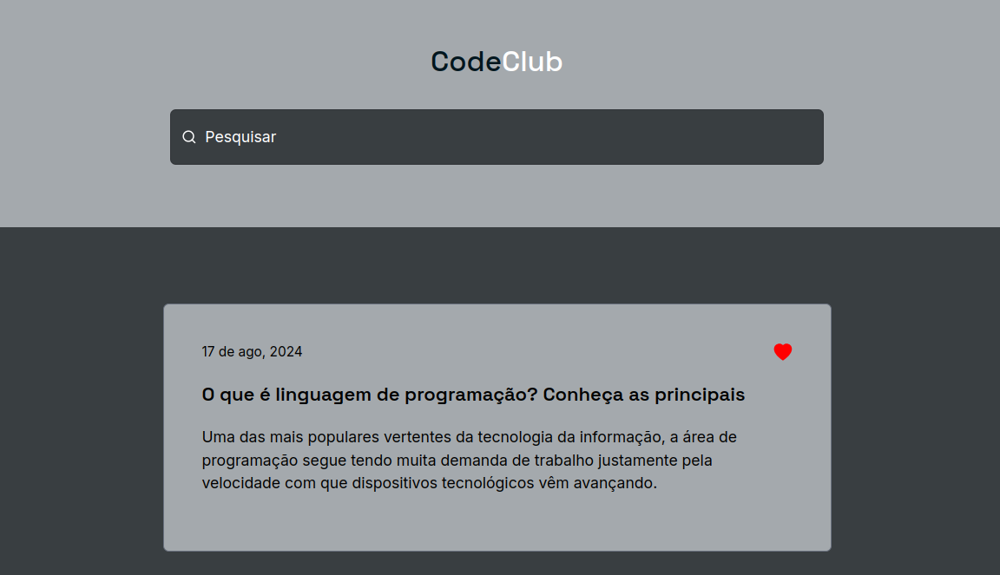

<h1 align="center"> Code Club </h1>

Projeto desenvolvido com base no Desafio 01 do repositório [desafios-frontend](https://github.com/iuricode/desafios-frontend)  

  <a href="#-tecnologias">Tecnologias</a>&nbsp;&nbsp;&nbsp;|&nbsp;&nbsp;&nbsp;
  <a href="#-projeto">Projeto</a>&nbsp;&nbsp;&nbsp;|&nbsp;&nbsp;&nbsp;
  <a href="#-layout">Layout</a>&nbsp;&nbsp;&nbsp;|&nbsp;&nbsp;&nbsp;

 

  

## 🚀 Tecnologias

Esse projeto foi desenvolvido com as seguintes tecnologias:

- HTML e CSS
- ReactJS
- TailwindCSS
- Git e Github
- Figma

## 💻 Projeto

O Habits é um app para ajudar a rastrear os hábitos.

- [Acesse o projeto finalizado, online](https://code-club-tau.vercel.app/)

## 🔖 Layout

Você pode visualizar o layout do projeto através [DESSE LINK](https://www.figma.com/design/Yb9IBH56g7T1hdIyZ3BMNO/Desafios---CodeLab?node-id=0-1&node-type=CANVAS&t=S1LLhS1plip0ZXdq-0). É necessário ter conta no [Figma](https://figma.com) para acessá-lo.